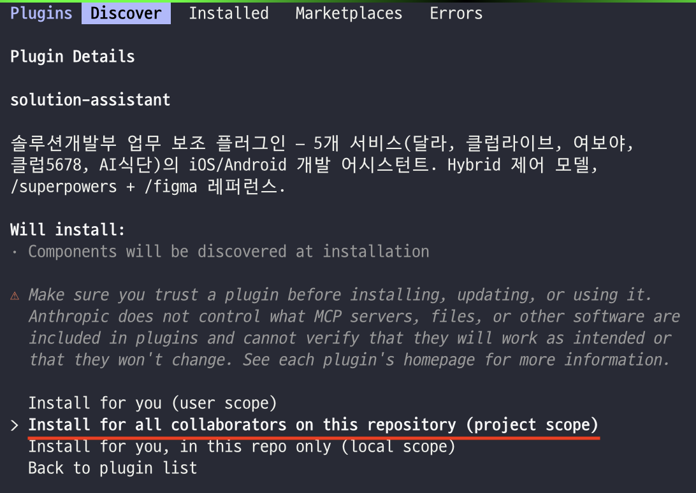
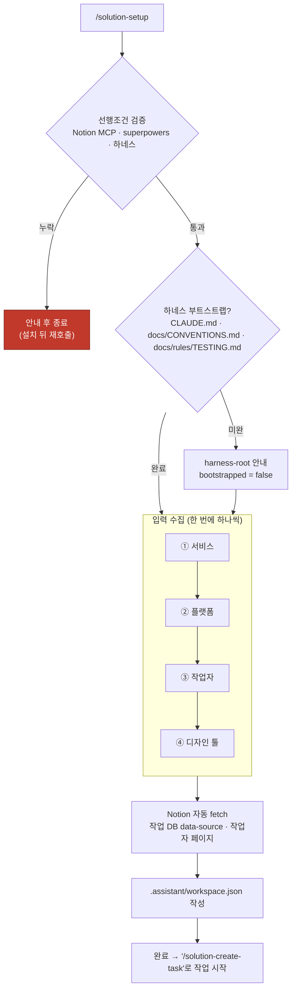
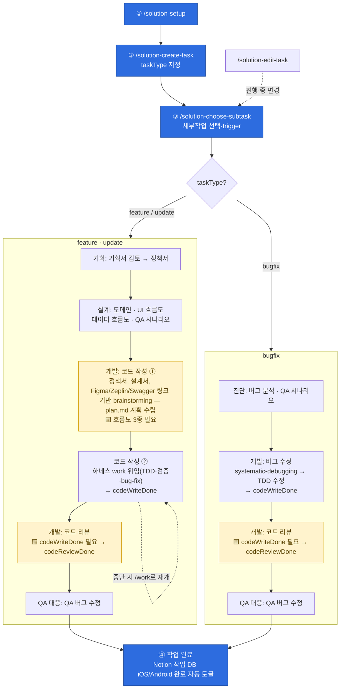

# solution-assistant

> **솔루션개발부 업무 보조 플러그인** — 5개 서비스(달라 · 클럽라이브 · 여보야 · 클럽5678 · 하루온) × iOS/Android × feature/update/bugfix.
>
> 작업 하나의 전 과정(기획서 검토 → 코드 → 리뷰 → QA → 종결)을 세부작업 단위로 안내하고, 산출물을 Notion에 축적한다.

## 설치

**1. 선행조건 (필수)** — 없으면 `/solution-setup`이 차단한다.

- **Notion MCP** (`notion-*`) — 산출물 본문 저장소 + 작업 DB
- **superpowers 플러그인** — brainstorming · writing-plans 등 프로세스 스킬
- **하네스 플러그인** (`solution-harness`) — write-code가 코드 구현을 위임하는 `work` 엔진

> 디자인 툴(Figma/Zeplin)은 선택 연동이다(차단하지 않음).

**2. 마켓플레이스 등록 → 설치**

```bash
/plugin marketplace add <이 저장소 경로 또는 git URL>
/plugin install solution-assistant@solution-marketplace
/plugin install solution-harness@solution-marketplace   # 필수 선행조건 — 같은 마켓플레이스에 카탈로그됨
```

> `superpowers`와 Notion MCP는 외부 소스라 별도로 설치한다(이 마켓플레이스엔 없음).

**3. Project Scope로 설치** — `.assistant/`(로컬 상태)와 repo 하네스 문서를 대상으로 동작하므로 **관리 대상 repo에 project scope**로 설치한다.

`/plugin` 실행 → **Marketplaces** 탭 → `solution-marketplace`에서 `solution-assistant` 선택 → **project scope**(*Install for all collaborators on this repository*) 선택.



설치 후 `/solution-setup`을 먼저 실행한다.

## 용어

- **task (작업)** — 개발 단위 하나(예: `DCL-1234`). `.assistant/<작업번호>/task.json`이 메타데이터를 캐시하고, 권위 출처는 Notion 작업 row. 병렬 작업 허용.
- **subtask (세부작업)** — 작업를 진행하는 개별 작업. 진행 상태·선행조건·순서 개념 없이 자유 선택된다(일부 하드 게이트 제외). 완료 판정은 `task.json.links`의 키 존재 여부로만. 목록은 작업 유형별로 다르다.

## 프로젝트 초기설정

`/solution-setup`으로 워크스페이스를 초기화한다 — **다른 스킬을 쓰기 전 반드시 먼저 실행**.

- **검증** — 3대 선행조건(Notion MCP · superpowers · 하네스)
- **수집** — 서비스 · 플랫폼(iOS/Android) · 작업자 · Notion 작업 DB → `.assistant/workspace.json`에 기록
- **확인** — 현재 repo의 하네스 부트스트랩(루트 문서 존재)



## 작업 유형

| 유형 | 라벨 | 구성 |
|---|---|---|
| **feature** | 신규 개발 | 기획 → 설계 → 개발 → QA 대응 → 종결 |
| **update** | 변경/고도화 | feature와 동일 구성, 문서 스킬 라벨만 "수정" |
| **bugfix** | 버그 수정 | 진단 → 개발 → QA 대응 → 종결 (기획·설계 없음) |

## 기능

직접 호출 가능한 진입점은 5개다. 세부작업(작업 종결 등)은 `/solution-choose-subtask`이 trigger한다.

| 기능 | 호출 |
|---|---|
| 프로젝트 설정 | `/solution-setup` |
| 작업 생성 | `/solution-create-task <작업번호>` |
| 작업 진행 (세부작업 선택·trigger) | `/solution-choose-subtask` |
| 진행 중 변경 전파 | `/solution-edit-task` |
| 마찰 로그 분석 (보조) | `/solution-insights` |

> **작업 완료**는 `/solution-choose-subtask` → **작업 종결** 세부작업으로 진행한다.

**진입 하드 게이트** (choose-subtask이 trigger 직전 검사):

- feature `코드 작성` — 정책서 · UI 흐름도 · 데이터 흐름도가 모두 있어야 진입
- `코드 리뷰` — `codeWriteDone` 필요 · `작업 종결` — `codeReviewDone` 필요

## 전체 흐름

> 🟦 직접 호출 진입점 · 🟨 하드 게이트(선행 문서·플래그 필요) · ⬜ 세부작업 · ⟲ 코드 작성(하네스 work 위임) 중단 시 `/work`로 재개



## 세부작업 지도

작업 유형별 세부작업 전체와 산출물. 완료 판정은 문서형은 `task.json.links` 키 존재, 코드형은 플래그(`codeWriteDone`/`codeReviewDone`)로 한다.

**feature · update** (라벨: feature → update)

| 그룹 | 세부작업 | 스킬 키 | 산출물 |
|---|---|---|---|
| 기획 | 기획서 검토 | `write-policy-feedback` | Notion `기획서 검토 - <버전>` (버전마다 누적) |
| 기획 | 정책서 작성 → 수정 | `write-policy` | Notion `정책서` (단일) |
| 설계 | 도메인 명세서 (→ 수정) | `write-domain` | Notion `도메인 명세서` (단일) |
| 설계 | UI 흐름도 (→ 수정) | `draw-ui-flow` | Notion `UI 흐름도` (단일) |
| 설계 | 데이터 흐름도 (→ 수정) | `draw-data-flow` | Notion `데이터 흐름도` + `통신 명세서` (다중) |
| 설계 | QA 시나리오 | `write-qa` | Notion DB (행 = 테스트 케이스) |
| 개발 | 코드 작성 → 코드 수정 | `write-code` | 코드 (하네스 `work` 위임) · Notion 없음 → `codeWriteDone` 🟨 |
| 개발 | 코드 리뷰 | `review-code` | 리뷰 → `codeReviewDone` 🟨 |
| QA 대응 | QA 버그 수정 | `fix-qa-bug` | 코드 |
| 종결 | 작업 종결 | `finish-task` | Notion 작업 DB iOS/Android 완료 토글 🟨 |

**bugfix** (기획·설계 없음)

| 그룹 | 세부작업 | 스킬 키 | 산출물 |
|---|---|---|---|
| 진단 | 버그 분석 | `analyze-bug` | Notion `버그 분석` (단일) |
| 진단 | QA 시나리오 | `write-qa` | Notion DB (행 = 테스트 케이스) |
| 개발 | 버그 수정 | `fix-bug` | 코드 → `codeWriteDone` 🟨 |
| 개발 | 코드 리뷰 | `review-code` | 리뷰 → `codeReviewDone` 🟨 |
| QA 대응 | QA 버그 수정 | `fix-qa-bug` | 코드 |
| 종결 | 작업 종결 | `finish-task` | Notion 작업 DB iOS/Android 완료 토글 🟨 |

> 🟨 = 하드 게이트 근거 플래그. 문서 스킬은 진입 시 `sync-links`로 `task.json.links`를 Notion 작업 row 자식 페이지와 동기화한다. 스키마·상수 정본: [`references/state-schema.md`](references/state-schema.md), [`hooks/lib/constants.json`](hooks/lib/constants.json).
